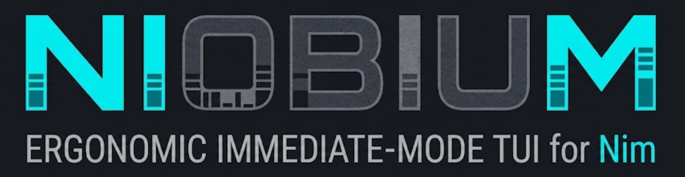

# TATUÍ



**An ergonomic, immediate-mode Terminal User Interface (TUI) library for Nim.**

TATUÍ helps you build rich, flicker-free terminal apps by describing your UI as a pure function of
your application state. You rebuild the interface every tick; TATUÍ figures out the minimal set of
cells that actually changed and updates only those.

> Status: v1 core is implemented and tested — core buffer/diff, ANSI + test backends, constraint
> layout, the terminal tick loop, an event decoder, and the widget set (Block, Paragraph, List,
> Table, Tabs, Clear, Gauge, Sparkline, BarChart, Scrollbar, Chart).

## Why TATUÍ

- **Immediate mode, no flicker.** Draw your whole UI each frame from current state. A retained cell
  buffer is diffed under the hood, so only real changes are written to the terminal.
- **Constraint-based layout.** No absolute coordinates — split areas with `Length`, `Percentage`,
  `Ratio`, `Min`, `Max`, and `Fill`, and let the layout engine do the arithmetic.
- **Backend-agnostic.** Drawing logic never touches the OS directly; everything flows through a small
  `Backend` concept, which also makes rendering fully testable without a real terminal.
- **Built for Nim.** Value types and `seq`-backed buffers, an allocation-free steady-state render
  path, and `--mm:orc` throughout.

## The three pillars

1. **Double buffering + diffing** — widgets write into an in-memory `Buffer`; TATUÍ diffs it
   against the previous frame and emits only the deltas.
2. **Backend agnosticism** — spatial and drawing logic knows nothing about the terminal; output goes
   through the `Backend` concept.
3. **Constraint-based layout** — `Rect`s are split by constraints, not fixed positions.

## Platform support

Linux and macOS, via pure ANSI escape sequences and termios raw mode. (Windows is not targeted in
v1.)

## Installation

```sh
nimble install tatui
```

Requires Nim ≥ 2.0.

## A taste of the API

```nim
import tatui

var term = newTerminal(newAnsiBackend())
term.setup()
defer: term.restore()

term.draw proc(f: var Frame) =
  let chunks = f.area.split(Vertical, @[length(3), fill(1)])
  f.renderWidget(initBlock(title = " TATUÍ ", borders = AllBorders), chunks[0])
  f.renderWidget(paragraph("Hello, terminal!"), chunks[1])
```

See runnable examples in [`examples/`](examples): `examples/hello.nim` (interactive) and
`examples/demo.nim` (renders a dashboard to text, no TTY required).

## Project layout

- `src/tatui/` — library source (`core`, `layout`, `backend`, `terminal`, `event`, `widgets`).
- `specs/` — behavior specs written before the code that implements them.
- `docs/adr/` — architecture decision records.
- `docs/reference/` — the ratatui parity map and trimmed terminal references.

## Contributing

TATUÍ is spec-first: adjust the spec in `specs/`, add a failing test, then implement. See
[`AGENTS.md`](AGENTS.md) for the reasoning loop and Definition of Done, and
[`.github/copilot-instructions.md`](.github/copilot-instructions.md) for the architectural
invariants. Please be kind and constructive in issues and reviews — everyone here is learning and
building together. 💚

## Acknowledgements

TATUÍ stands on the shoulders of [**ratatui**](https://github.com/ratatui/ratatui), the wonderful
Rust TUI library whose architecture — double buffering, backend abstraction, and constraint-based
layout — is the direct inspiration for this project. Huge thanks to the ratatui maintainers and
community for their thoughtful design and generous open-source work. If you write Rust, go build
something with ratatui. 🐁❤️

We also thank the Nim community for a language that makes this kind of library a joy to write.

## License

MIT. See [`LICENSE`](LICENSE).
